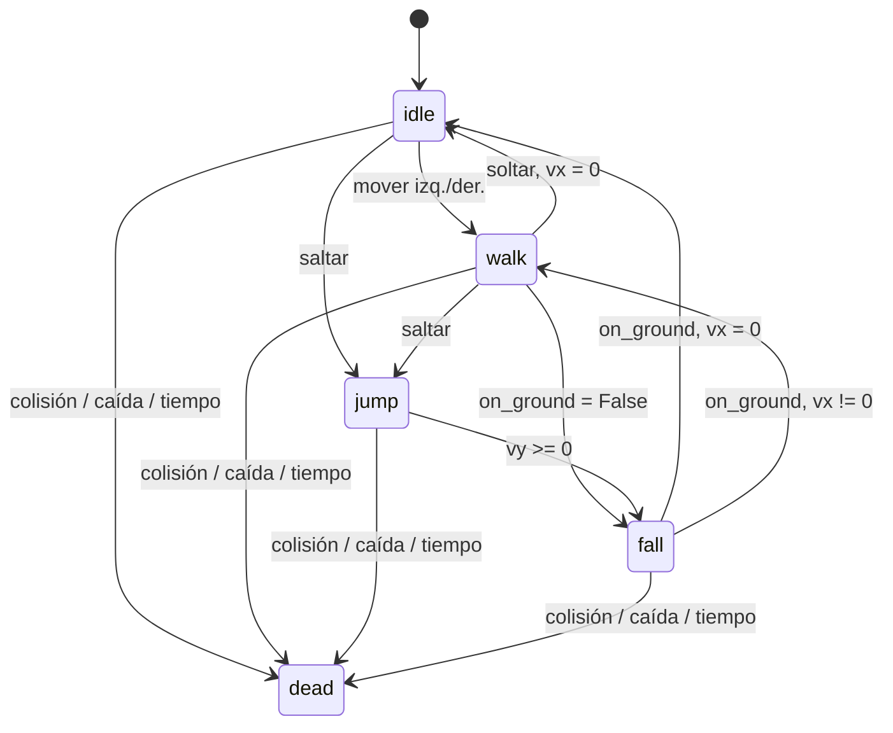

# Capítulo 7: Plataformas, Mapas de Tiles y la Cámara de `gale`

> “Un juego divertido siempre debería ser fácil de entender: deberías poder echarle un vistazo y saber de inmediato qué tienes que hacer. Tiene que estar tan bien construido que puedas ver de un vistazo cuál es tu objetivo y, aunque no lo consigas, te eches la culpa a ti mismo y no al juego.”
>
> —Shigeru Miyamoto, *Iwata Asks: New Super Mario Bros. Wii*, Nintendo

Los juegos anteriores caben enteros en una sola pantalla, y su escenario, cuando lo tienen, está escrito directamente en código. Super Martian rompe ambos supuestos. Su nivel es más ancho que la ventana, así que el mundo y la vista sobre el mundo dejan de ser la misma cosa. Además, ese nivel es demasiado grande para seguir describiéndolo con coordenadas sueltas en el código fuente: necesita venir de un archivo de datos dibujado con una herramienta, no tecleado a mano. Este capítulo resuelve esas dos necesidades —carga de niveles como datos y una cámara como abstracción propia— y termina con el personaje animado que corre y salta sobre ese nivel. Los tres temas —mapas de tiles, cámara, animación— son independientes entre sí, pero Super Martian los necesita juntos. No tiene sentido dibujar un nivel más grande que la pantalla sin una cámara que decida qué parte mostrar, ni tiene sentido animar un personaje que no puede recorrer ese nivel porque todavía choca con las paredes como si fuera un rectángulo suelto del Capítulo 5.

## 7.1. Contexto histórico: el salto que reinició la industria

Super Martian es, deliberadamente, un juego de plataformas de desplazamiento lateral con nombres y personajes propios; pero la mecánica y el diseño de nivel que reconstruye tienen un origen concreto y bien documentado: *Super Mario Bros.*, desarrollado por Nintendo bajo la dirección de Shigeru Miyamoto y Takashi Tezuka.

El juego nació en un momento de crisis para la industria. Tras el llamado “crac de los videojuegos de 1983” en Norteamérica —una saturación del mercado con productos de baja calidad que hundió las ventas del sector—, Nintendo apostó por un nuevo sistema doméstico: la Family Computer (Famicom), lanzada en Japón en 1983, y su versión occidental, la Nintendo Entertainment System (NES), introducida en Estados Unidos en 1985 (Altice, 2015; Sheff, 1993). Miyamoto, ya responsable de *Donkey Kong* y de la serie *Mario Bros.*, dirigió junto con Tezuka el desarrollo de *Super Mario Bros.*, lanzado en Japón el 13 de septiembre de 1985 como título de acompañamiento de la consola. Su éxito comercial —más de 40 millones de copias, récord que mantuvo durante casi tres décadas— fue decisivo para restaurar la confianza del público en los videojuegos domésticos tras el crac de 1983 (Ryan, 2011).

Desde el punto de vista técnico y de diseño, *Super Mario Bros.* consolidó convenciones que este mismo capítulo reconstruye en miniatura: el desplazamiento lateral continuo de la cámara, una física de salto parabólica con control aéreo variable según la duración de la pulsación del botón, y un diseño de nivel que enseña sus propias reglas de forma implícita mediante la disposición espacial de obstáculos y enemigos. Su primer nivel se ha estudiado extensamente como modelo de tutorial jugable sin texto explicativo (Dahlskog & Togelius, 2012; Summerville et al., 2017). Ese vocabulario de diseño —ritmo de avance, curva de dificultad progresiva, retroalimentación inmediata— es, precisamente, el que da forma al mapa de tiles y a la física de Super Martian en el resto de este capítulo.


*Figura 7.1: Consola Nintendo Entertainment System (NES), la plataforma para la que se lanzó Super Mario Bros. en 1985. Fotografía de Evan-Amos, dominio público, vía Wikimedia Commons.*

## 7.2. Niveles como datos: mapas de tiles

Crear un nivel directamente en código fuente (una lista de posiciones de plataformas, como hubiera bastado para los juegos anteriores) deja de ser razonable en cuanto el nivel tiene el tamaño de un nivel real. El mapa de tiles de Super Martian mide 50 columnas por 12 filas de tiles de 16 × 16 píxeles, 600 celdas por capa, y hay varias capas. Nadie quiere calcular a mano las coordenadas de cada bloque de un mapa así, y mucho menos volver a hacerlo cada vez que se ajusta el diseño. La alternativa es dibujar el nivel con una herramienta —Tiled es la que usa este libro— que permite pintar tiles con el mouse sobre una grilla visual y exportar el resultado como un archivo de datos (JSON). Luego hace falta escribir un cargador que convierta ese archivo en las estructuras que el juego necesita en tiempo de ejecución. Esta es, en esencia, la misma separación entre datos y código que ya se practicó al leer un archivo de configuración o un nivel de Match3 generado proceduralmente (Capítulo 6): el contenido del nivel deja de estar mezclado con la lógica que lo interpreta.

Cuatro ideas hacen falta para entender un mapa de Tiled:

- **Tileset:** una única imagen con todos los tiles posibles, recortada en una grilla regular. Cada tile recibe un identificador entero (su `gid`, *global tile id*) que el mapa referencia en lugar de repetir la imagen. El tileset de Super Martian, por ejemplo, es una imagen de 112×176 píxeles recortada en tiles de 16×16, es decir, 77 tiles distintos numerados del 1 en adelante (el `gid` 0 está reservado por Tiled para significar “celda vacía”).
- **Capa de tiles:** el nivel como una grilla de `gid`s (la misma idea de grilla discreta del Capítulo 6, aplicada ahora a geografía en vez de piezas), organizada en varias capas superpuestas —fondo, primer plano, colisión— que se dibujan en orden, de atrás hacia adelante.
- **Capa de objetos:** puntos anotados sobre el mapa —dónde aparece cada enemigo, dónde hay una moneda— que Tiled permite colocar visualmente pero que no significan absolutamente nada para la herramienta misma: son solo un nombre, un tipo, una posición y, opcionalmente, propiedades personalizadas. Su significado (“aquí aparece una babosa”, “aquí hay una moneda de tipo 3”) lo decide por completo el juego que los lee.
- **Colisión como propiedad de tile, no como capa especial:** en lugar de una capa separada con un formato propio, Tiled permite anotar propiedades personalizadas sobre tiles individuales del tileset, por ejemplo, una propiedad de texto `"collision"` con valor `"solid"` o `"platform"`, y esas propiedades viajan con el `gid` a cualquier capa que lo use.

La Figura 7.2 vuelve visible esta indirección: cada celda del tileset tiene un número (su `gid`), y cada celda de una capa del mapa no guarda una imagen sino simplemente uno de esos números, que el motor usa para buscar el tile correspondiente al dibujar.

```text
Tileset (imagen única)            Capa de tiles del mapa (gids)
┌───┬───┬───┐                    ┌───┬───┬───┬───┬───┐
│ 4 │ 5 │ 6 │                    │ 2 │ 2 │ 3 │   │   │
├───┼───┼───┤                    ├───┼───┼───┼───┼───┤
│ 1 │ 2 │ 3 │                    │ 5 │ 5 │ 5 │ 5 │ 5 │
└───┴───┴───┘                    └───┴───┴───┴───┴───┘

Las celdas resaltadas comparten el mismo gid (5):
la del mapa referencia el tile del tileset.
```

*Figura 7.2: Tileset (izquierda), una única imagen recortada en tiles, cada uno con un `gid`, frente a una capa del mapa (derecha), solo una grilla de esos números enteros, sin repetir nunca la imagen.*

### 7.2.1. Cómo lo implementa `gale`: `gale.tilemap`

`gale.tilemap.load_tiled_map` recibe la ruta de un archivo exportado por Tiled como JSON (no el formato XML `.tmx`) y construye un `TileMap` completo a partir de él:

```python
def load_tiled_map(path: str) -> TileMap:
    with open(path, "r", encoding="utf-8") as f:
        map_data = json.load(f)

    if map_data.get("infinite"):
        raise TiledLoadError(
            "Infinite maps are not supported. In Tiled, disable "
            "Map > Map Properties > Infinite before exporting."
        )

    tile_width = map_data["tilewidth"]
    tile_height = map_data["tileheight"]
    cols = map_data["width"]
    rows = map_data["height"]

    tilemap = TileMap(tile_width, tile_height, cols, rows)
    base_dir = os.path.dirname(path)

    for tileset_ref in map_data.get("tilesets", []):
        tilemap.add_tileset(_load_tileset(tileset_ref, base_dir))

    for layer in map_data.get("layers", []):
        _load_layer(tilemap, layer, cols, rows)

    return tilemap
```

Tres decisiones de este código merecen comentario. Primero, un mapa infinito (una opción de Tiled que expande el nivel bajo demanda en fragmentos) se rechaza explícitamente, ya que `TileMap` asume una grilla de tamaño fijo conocido de antemano. Por lo tanto, un mapa infinito debe convertirse a tamaño fijo antes de exportar. Segundo, `_load_layer` recorre las capas recursivamente porque Tiled permite agrupar capas dentro de grupos. El mapa de Super Martian, de hecho, envuelve todas sus capas de tiles dentro de un grupo llamado `"tilemap"`, y el cargador debe descender por esos grupos sin que el resto del código note la diferencia:

```python
def _load_layer(
    tilemap: TileMap, layer: Dict[str, Any], cols: int, rows: int
) -> None:
    layer_type = layer.get("type")

    if layer_type == "group":
        for child in layer.get("layers", []):
            _load_layer(tilemap, child, cols, rows)
    elif layer_type == "tilelayer":
        tilemap.add_layer(
            layer["name"], _load_tile_grid(layer, cols, rows)
        )
    elif layer_type == "objectgroup":
        tilemap.object_layers[layer["name"]] = [
            _load_object(obj) for obj in layer.get("objects", [])
        ]
```

Tercero, y más importante para el propio diseño del formato, un `TiledObject` (lo que aparece en una capa de objetos) es deliberadamente una estructura de datos plana, sin ningún comportamiento:

```python
@dataclass
class TiledObject:
    name: str
    type: str
    x: float
    y: float
    width: float
    height: float
    properties: Dict[str, Any] = field(default_factory=dict)
```

`load_tiled_map` nunca decide qué significa un objeto llamado `"enemy"` o de tipo `"coin"`; simplemente entrega el dato completo y deja que el juego decida. Super Martian aprovecha exactamente esto en `GameLevel`, que después de cargar el mapa recorre dos capas de objetos, `"creatures"` y `"coins"`, y es él, no el cargador, quien interpreta cada una:

```python
class GameLevel:
    def __init__(self, num_level: int) -> None:
        self.tilemap = load_tiled_map(settings.TILEMAPS[num_level])
        self.creatures = []
        self.items = []

        for obj in self.tilemap.object_layers.get("creatures", []):
            self.add_creature(
                {
                    "tile_index": obj.properties["tile_index"],
                    "x": obj.x,
                    "y": obj.y,
                    "width": obj.width,
                    "height": obj.height,
                }
            )

        for obj in self.tilemap.object_layers.get("coins", []):
            self.add_item(
                {
                    "item_name": "coins",
                    "frame_index": obj.properties["frame_index"],
                    "x": obj.x,
                    "y": obj.y,
                    "width": obj.width,
                    "height": obj.height,
                }
            )
```

El diseñador del nivel colocó un objeto en Tiled, le puso el nombre `"creatures"` a su capa y le agregó una propiedad personalizada `tile_index`. Nada de eso obliga a que exista una babosa en el juego: esa decisión vive enteramente en `GameLevel.add_creature`, que consulta el diccionario `creatures.CREATURES` definido en el propio código del juego. El archivo de Tiled y el código de Python se mantienen así completamente desacoplados, ya que el diseñador puede mover, agregar o quitar enemigos sin tocar una sola línea de Python, siempre que respete el contrato de nombres y propiedades que el juego espera.

La colisión, por su parte, vive en un módulo separado (`gale.tilemap.collision`) que nunca sabe nada de gravedad, velocidad ni de ningún motor de física. Esto es deliberado: `gale.tilemap` no depende en absoluto de `gale.physics` ni de `pymunk`. Es una capa de colisión sencilla por rejilla, apropiada justamente para un plataformero que no necesita cuerpos rígidos ni resolución de contactos complejos. Define solo dos tipos de bloqueo:

```python
class CollisionType:
    NONE: str = "none"
    SOLID: str = "solid"
    PLATFORM: str = "platform"
```

Un tile `SOLID` bloquea el movimiento en cualquier dirección. Un tile `PLATFORM` es de un solo sentido: se puede parar encima y saltar a través de él desde abajo, exactamente como las plataformas flotantes de *Super Mario Bros.* y sus muchos descendientes (véase el contexto histórico al inicio del capítulo). `collision_type_at` traduce un `gid` a uno de estos dos valores (o `NONE`) leyendo la propiedad personalizada `"collision"` que el diseñador anotó sobre ese tile en el tileset de Tiled:

```python
def collision_type_at(
    tilemap: TileMap,
    layer_name: str,
    row: int,
    col: int,
    collision_property: str = DEFAULT_COLLISION_PROPERTY,
) -> str:
    if not tilemap.in_bounds(row, col):
        return CollisionType.NONE

    gid = tilemap.get_gid(layer_name, row, col)

    if gid == 0:
        return CollisionType.NONE

    value = tilemap.properties_of_gid(gid).get(
        collision_property, CollisionType.NONE
    )
    return (
        value
        if value in (CollisionType.SOLID, CollisionType.PLATFORM)
        else CollisionType.NONE
    )
```

Y `move_and_collide` es la función que un personaje llama cada cuadro para avanzar: recibe su posición y tamaño actuales más el desplazamiento deseado (`dx`, `dy`), y devuelve la posición resultante junto con dos banderas que indican si el movimiento fue detenido en cada eje. Resuelve los ejes por separado, primero `x` y luego `y` —el orden habitual en un plataformero 2D—, para que deslizarse contra una pared no termine hundiéndose también en el piso. Además, hace todo el cálculo en punto flotante sin redondear nunca la posición internamente, ya que redondear reintroduciría exactamente el error que esta función evita: un personaje apoyado en el suelo que “vuelve a caer” una fracción de píxel cada cuadro y por lo tanto parpadea entre apoyado y no apoyado.

### 7.2.2. El nivel de Super Martian como archivo real

El archivo `assets/tilemaps/level1.json` de Super Martian (`05-super_martian` en el repositorio) sigue exactamente esta estructura: 50 columnas por 12 filas de tiles de 16×16, un grupo `"tilemap"` que contiene las capas de tiles (entre ellas, la capa `"ground"` que `GameEntity` usa como capa de colisión), y dos capas de objetos, `"creatures"` y `"coins"`. En el tileset, el tile de `gid` local 6 (el bloque de tierra) tiene la propiedad `"collision": "solid"`. Otro tile, usado para las plataformas flotantes, tiene `"collision": "platform"`. Ningún tile sin esa propiedad —el fondo decorativo, por ejemplo— bloquea nada en absoluto. Es decir, la colisión es estrictamente *opt-in*, tile por tile.

## 7.3. Cámara y espacio de mundo

Un nivel de 50 × 16 = 800 píxeles de ancho no cabe en una ventana virtual de 400 píxeles (la resolución virtual que usa Super Martian, según `settings.VIRTUAL_WIDTH`). Esto obliga a distinguir, por primera vez en el libro, entre dos sistemas de coordenadas: el espacio de mundo, donde vive la posición “real” de cada entidad dentro del nivel completo, y el espacio de pantalla, la porción de ese mundo que efectivamente se dibuja en un instante dado. La posición de un objeto ya no es directamente su posición al dibujar: hay que restarle el desplazamiento de la cámara y, en juegos con zoom, escalar también por un factor de zoom. Esto es algo que el Capítulo 10 retoma con una cámara que además se aleja y se acerca.

La pregunta de diseño interesante no es cómo calcular ese desplazamiento, sino cómo debe moverse la cámara cuadro a cuadro. La opción más simple —centrar la cámara exactamente en la posición del jugador en todo momento— se siente mal jugada. Cualquier movimiento brusco del jugador (arrancar a caminar, aterrizar de un salto) produce un salto igual de brusco en toda la vista, que resulta mareante. La solución estándar es hacer que la cámara persiga al jugador con suavizado exponencial —la misma fórmula de convergencia introducida en el Capítulo 1, con su tasa `k` renombrada aquí `r` por tratarse específicamente de una tasa de seguimiento—. De modo que, en cada cuadro, la cámara cierra solo una fracción de la distancia que la separa de su objetivo, en lugar de saltar el cien por ciento de esa distancia de una vez. Formalmente, si `r` es esa tasa de seguimiento y `Δt` el tiempo transcurrido, la fracción de la distancia que se cierra en ese cuadro es:

$$
f = 1 - e^{-r\Delta t}
$$

Y la nueva posición de la cámara es `x_cámara += (x_objetivo - x_cámara) · f`. Esta fórmula tiene una propiedad crucial que una interpolación lineal ingenua no tiene, y es independiente de la tasa de cuadros. Cerrar siempre “la misma fracción de la distancia restante por segundo”, no por cuadro, significa que la cámara converge a la misma velocidad percibida sin importar si el juego corre a 30 o a 144 cuadros por segundo. Es exactamente el mismo problema de independencia del `dt` que ya apareció al mover cualquier entidad con velocidad constante.

La Figura 7.3 grafica esa convergencia: partiendo de una posición inicial de 0 con un objetivo en 100, la posición de la cámara se acerca cada vez más rápido al principio y cada vez más lento cerca del final. Nunca llega del todo a superponerse con el objetivo, la firma característica de una convergencia exponencial.

Un refinamiento adicional, que este capítulo deja como ejercicio, es la zona muerta. En lugar de perseguir la posición exacta del jugador en todo momento, la cámara solo reacciona cuando el jugador sale de una región central de la pantalla, de modo que pequeños movimientos de ida y vuelta (caminar unos pocos píxeles, un salto corto) no produzcan ningún desplazamiento de cámara en absoluto.

> **Sin zona muerta, hasta un personaje quieto sacude la cámara**
>
> El suavizado exponencial de esta sección persigue la posición exacta del jugador. Por eso, cualquier micro-movimiento —el propio *jitter* de un salto que sube y baja un píxel por fotograma, por ejemplo— se traduce en un ajuste de cámara, por pequeño que sea. Visualmente esto se percibe como un temblor sutil pero constante, más notorio cuanto más se acerque el factor de suavizado a 1. Una zona muerta —perseguir la posición del jugador solo cuando se sale de una franja central, en vez de perseguir siempre el valor exacto— resuelve esto sin renunciar al suavizado. Así, la cámara permanece perfectamente quieta mientras el jugador se mantenga dentro de esa franja.

```text
posición de la cámara
100 |                         ───────── objetivo
    |                    ____
 50 |              _____/
    |         ____/
  0 |________/________________________________ tiempo (s)
      0                 1                  2

x_cámara(t), r = 4
```

*Figura 7.3: Convergencia de la cámara hacia su objetivo bajo suavizado exponencial (`f = 1 - e^{-rΔt}`, con `r = 4`): el avance es rápido al principio y se atenúa progresivamente, aproximándose al objetivo sin saltos bruscos.*

La Figura 7.4 hace concreta esta resta: el mundo completo del nivel es mucho más ancho que lo que la ventana puede mostrar, y la cámara solo recorta una ventana rectangular, el *viewport*, desplazada desde el origen del mundo. Para dibujar cualquier entidad hay que restarle exactamente ese desplazamiento antes de escalarla por el zoom.

```text
origen del mundo (0, 0)
┌────────────────────────────────────────────────────────┐
│          espacio de mundo (nivel completo)             │
│                                                        │
│             ┌───────────────────────┐                  │
│   offset →  │ viewport de la cámara│                  │
│ (xcam,ycam) │ (espacio de pantalla)│                  │
│             └───────────────────────┘                  │
└────────────────────────────────────────────────────────┘
```

*Figura 7.4: El mundo completo (rectángulo grande) contra el viewport de la cámara (rectángulo gris, más pequeño y desplazado). `offset` es exactamente la distancia que hay que restarle a la posición de mundo de cualquier entidad para saber dónde dibujarla en pantalla.*

### 7.3.1. Cómo lo implementa `gale`: `gale.camera`

`gale.camera.Camera` guarda, como estado propio, una posición `(x, y)`, el punto del mundo sobre el que está centrada, y un factor de zoom. `follow` no mueve la cámara de inmediato, sino que solo recuerda a qué objetivo debe seguir y con qué tasa, para que `update` haga el trabajo cuadro a cuadro:

```python
def follow(self, target, rate: Optional[float] = None) -> None:
    self._target = target
    self._follow_rate = rate


def _follow_target(self, dt: float) -> None:
    target_x = self._target.x
    target_y = self._target.y

    if self._follow_rate is None:
        self.x, self.y = target_x, target_y
        return

    # Frame-rate-independent exponential smoothing: closes the same
    # fraction of the remaining distance regardless of dt's size.
    factor = 1.0 - math.exp(-self._follow_rate * dt)
    self.x += (target_x - self.x) * factor
    self.y += (target_y - self.y) * factor
```

Esto es, literalmente, la fórmula de la sección anterior escrita en código. Si no se especifica `rate`, la cámara simplemente se ajusta a la posición del objetivo cada cuadro (el salto brusco que se quería evitar); si se especifica, converge exponencialmente hacia él. Super Martian usa `settings.CAMERA_FOLLOW_RATE = 8.0`, un valor lo bastante alto para sentirse responsivo sin llegar a sentirse instantáneo.

El desplazamiento efectivo entre mundo y pantalla, lo que hace falta restar a cualquier posición de mundo para dibujar en el lugar correcto, se deriva de la posición de la cámara y del tamaño de su viewport:

```python
@property
def offset(self) -> Tuple[float, float]:
    shake_x, shake_y = self._shake_offset
    return (
        self.x - self.viewport_width / (2 * self.zoom) + shake_x,
        self.y - self.viewport_height / (2 * self.zoom) + shake_y,
    )


def world_to_screen(self, point: Tuple[float, float]) -> Tuple[float, float]:
    offset_x, offset_y = self.offset
    world_x, world_y = point
    return (
        (world_x - offset_x) * self.zoom,
        (world_y - offset_y) * self.zoom,
    )


def screen_to_world(self, point: Tuple[float, float]) -> Tuple[float, float]:
    offset_x, offset_y = self.offset
    screen_x, screen_y = point
    return (
        screen_x / self.zoom + offset_x,
        screen_y / self.zoom + offset_y,
    )
```

`world_to_screen` y `screen_to_world` son, exactamente, la resta y el escalado descritos al principio de esta sección convertidos en una interfaz reutilizable, una la inversa de la otra. La segunda sirve, por ejemplo, para convertir un clic del mouse en la posición de mundo que hay debajo de él. `apply`, el método que efectivamente usa `GameLevel.render` y `DrawableMixin.render` para dibujar cada tile y cada entidad, no es más que `world_to_screen` sobre la esquina de un rectángulo, seguido de escalar también su ancho y alto:

```python
def apply(self, rect: pygame.Rect) -> pygame.Rect:
    x, y = self.world_to_screen((rect.x, rect.y))
    return pygame.Rect(
        round(x),
        round(y),
        round(rect.width * self.zoom),
        round(rect.height * self.zoom),
    )
```

Finalmente, `Camera` acepta un `bounds`, un rectángulo de mundo que la vista nunca debe cruzar, para que, cerca de los bordes del nivel, la cámara no muestre el vacío más allá del mapa. Super Martian fija esos límites al rectángulo completo del nivel:

```python
self.camera = Camera(settings.VIRTUAL_WIDTH, settings.VIRTUAL_HEIGHT)
self.camera.follow(self.player, rate=settings.CAMERA_FOLLOW_RATE)
self.camera.bounds = self.game_level.get_rect()
self.camera.x, self.camera.y = self.player.x, self.player.y
self.camera.update(0)
```

Nótese la penúltima línea: la cámara se inicializa exactamente en la posición del jugador (no en el origen del mundo) para evitar que el primer cuadro muestre un salto de suavizado gigantesco desde `(0, 0)` hasta donde arranca realmente el nivel. La última línea llama a `update(0)` una vez, con `dt=0`, únicamente para forzar el recorte contra `bounds` antes de dibujar el primer cuadro.

`TileMap.render` usa además la posición y el zoom de la cámara para calcular qué rango de filas y columnas es visible y dibujar solo esas, nunca el nivel completo. Esto solo tiene sentido gracias al mapa de tiles de la Sección 7.2, ya que sin una grilla explícita de celdas no habría un “rango visible” que calcular en absoluto.

## 7.4. Animación y plataformas

Un personaje no es una sola imagen sino una secuencia de cuadros de sprite: recortes de una única hoja de sprites —la misma técnica de `gale.frames` ya usada para trocear tilesets— mostrados en orden a una tasa fija. Cuál secuencia mostrar en cada instante lo decide una pequeña máquina de estados propia del personaje: quieto (`idle`), caminando (`walk`), saltando (`jump`), y así sucesivamente.

Esta máquina de estados de animación es conceptualmente independiente de la máquina de estados de comportamiento que ya introdujo Match3 para las piezas: una decide qué dibujar, la otra decide qué hacer. En Super Martian ambas coinciden en los mismos nombres (`idle`, `walk`, `jump`) por conveniencia, pero `Player` las mantiene como dos mecanismos separados —un `state_machine` de comportamiento y un diccionario `animations` de reproducción— que simplemente se sincronizan al entrar a cada estado.

Antes de entrar al código, vale la pena fijar la idea con una analogía —puramente ilustrativa, no algo que `gale` implemente literalmente así— que cualquiera que haya hojeado un *flipbook* reconocerá de inmediato. Ese cuadernillo tiene páginas con dibujos ligeramente distintos que, al pasarse rápido con el pulgar, producen la ilusión de un dibujo que se mueve. Cada página del cuadernillo es, en esta comparación, un cuadro recortado de la hoja de sprites. Pasar las páginas a un ritmo constante —ni muy rápido ni muy lento, siempre el mismo tiempo por página— es exactamente lo que hace el temporizador de una animación, que acumula tiempo cuadro a cuadro y, al cumplirse un intervalo fijo, “pasa la página” avanzando al siguiente índice de la secuencia. La comparación no debe estirarse más allá de esto: un flipbook no tiene noción de bucle infinito ni de contar cuántas veces se completó. Pero alcanza para tener en mente la idea central antes de ver cómo `gale.animation` la implementa realmente.

### 7.4.1. Cómo lo implementa `gale`: `gale.animation`

`gale.animation.Animation` es deliberadamente pequeña: guarda una secuencia de cuadros, un intervalo de tiempo fijo entre ellos, y un temporizador interno que decide cuándo avanzar:

```python
def update(self, dt: float) -> None:
    if self.size <= 1 or (
        self.loops is not None and self.times_played >= self.loops
    ):
        return

    self.timer += dt

    if self.timer >= self.interval:
        self.timer %= self.interval
        self.current_frame_index = (self.current_frame_index + 1) % self.size

        if self.current_frame_index == 0 and self.loops is not None:
            self.times_played += 1

            if self.times_played >= self.loops:
                self.current_frame_index = len(self.frames) - 1
                self.on_finish()


def get_current_frame(self) -> Any:
    return self.frames[self.current_frame_index]
```

El temporizador se acumula en `self.timer` y, cuando alcanza el intervalo, avanza un cuadro y le resta el intervalo con `%=` en lugar de reiniciarlo a cero. De modo que, si un cuadro de juego tarda más de un intervalo completo (una pausa del sistema operativo, un `dt` inusualmente grande), el sobrante no se pierde y la animación no se desincroniza silenciosamente de lo que debería mostrar. Si `loops` es `None` la animación se repite para siempre; si es un número, cuenta cuántas veces completó el ciclo y, al llegar a ese número, se congela en el último cuadro e invoca `on_finish`.

`Player` define sus animaciones declarativamente, una por estado de comportamiento:

```python
animation_defs = {
    "idle": {"frames": [0]},
    "walk": {"frames": [9, 10], "interval": 0.15},
    "jump": {"frames": [2]},
}
```

`idle` y `jump` son animaciones de un solo cuadro (una pose fija); `walk` alterna entre dos cuadros cada 0.15 segundos. Cada estado de comportamiento, al entrar, llama a `self.entity.change_animation(...)` con el nombre correspondiente: `IdleState.enter` llama a `change_animation("idle")`, `WalkState.enter` a `change_animation("walk")`, y así con cada uno. `AnimatedMixin.change_animation` solo reinicia la animación si de verdad cambió, para que reentrar al mismo estado dos veces seguidas no reinicie el ciclo de cuadros a mitad de camino.

### 7.4.2. Plataformas: apoyo, salto y colisión contra el mapa

La física de plataformas de Super Martian ya no resuelve colisión lado por lado a mano como el AABB del Capítulo 5: en su lugar, cada entidad delega en `move_and_collide` contra la capa de colisión del mapa (Sección 7.2). `GameEntity.update`, la base compartida por `Player` y `Creature`, aplica gravedad incondicionalmente y luego mueve la entidad un solo paso:

```python
def update(self, dt: float) -> None:
    self.vy += settings.GRAVITY * dt

    self.state_machine.update(dt)
    mixins.AnimatedMixin.update(self, dt)

    self.x, self.y, self.collided_x, collided_y = move_and_collide(
        self.tilemap,
        self.COLLISION_LAYER,
        self.x,
        self.y,
        self.width,
        self.height,
        self.vx * dt,
        self.vy * dt,
    )

    if collided_y:
        if self.vy > 0:
            self.on_ground = True
        self.vy = 0
    else:
        self.on_ground = False
```

`on_ground`, la bandera que decide si la entidad puede saltar de nuevo, no se calcula con una comprobación geométrica aparte (por ejemplo, “¿hay un tile sólido un píxel debajo?”). Se deriva directamente de si `move_and_collide` detuvo el movimiento vertical mientras la entidad caía (`vy > 0`). Esto es deliberado: reutiliza el mismo cálculo que ya hizo la resolución de colisión en lugar de duplicar la lógica de detección de piso. Así se evita la clase de desincronización donde el chequeo de piso y la colisión real no están de acuerdo cuadro a cuadro.

Los estados de comportamiento consultan esa bandera para decidir sus transiciones: `WalkState.update` cambia a `"fall"` en cuanto `on_ground` se vuelve falso, y `FallState.update` vuelve a `"walk"` o `"idle"` en cuanto vuelve a ser verdadero. `JumpState.enter`, por su parte, simplemente asigna una velocidad vertical negativa (hacia arriba, recordando la convención de ejes del Capítulo 1) e ignora por completo si hay o no un tile encima, porque esa comprobación ya la hace `move_and_collide` en el siguiente cuadro.

Estas condiciones reales —`on_ground`, el signo de `vy`, si hay o no velocidad horizontal— son exactamente las aristas de la máquina de estados de comportamiento del jugador, y no una simplificación con fines didácticos. `Player` la construye a partir de un diccionario real de clases (`IdleState`, `WalkState`, `JumpState`, `FallState`, `DeadState`, todas subclases de `gale.state.BaseState`), la misma maquinaria de `gale.state.StateMachine` ya vista en el Capítulo 4.

La Figura 7.5 dibuja esas cuatro clases de movimiento con sus transiciones reales. `dead` se incluye aparte porque, a diferencia de las demás, nadie la dispara desde adentro de la propia máquina de estados: ninguna de las clases anteriores llama a `change_state("dead")`. Es `PlayState.update` quien vigila, cuadro a cuadro y desde afuera, tres condiciones ajenas al movimiento: una colisión contra una criatura, caer por debajo del final vertical del mapa, o que el temporizador de la partida llegue a cero.



*Figura 7.5: Máquina de estados de comportamiento de `Player` en Super Martian, con sus transiciones reales: `idle` y `walk` se alternan según se presione o se suelte movimiento horizontal, cualquiera de los dos pasa a `jump` al presionar saltar, `jump` cae a `fall` en cuanto `vy` deja de ser negativa, y `fall` vuelve a `walk` o `idle` según haya o no velocidad horizontal en el momento de tocar el suelo. `dead` (borde punteado en el original) no es disparado por ninguna de estas clases sino observado y forzado desde afuera, por `PlayState`.*

El punto de aparición del jugador ilustra por qué la distinción entre tile `SOLID` y `PLATFORM` de la Sección 7.2 importa en la práctica: `PlayState.enter` coloca al jugador exactamente apoyado sobre la superficie de una plataforma, no unos píxeles adentro de ella. Esto es necesario porque la colisión de una sola vía exige que la entidad ya esté a la altura de la superficie o por encima antes de la llamada; de lo contrario, el jugador atravesaría la plataforma en el primer cuadro en lugar de apoyarse en ella.

### 7.4.3. Entrada como intención reutilizable: `gale.command`

Las etiquetas “mover izq./der.” y “saltar” de la Figura 7.5 dejan una pregunta abierta: ¿quién dispara exactamente esas transiciones? En el Capítulo 5 (Sección 5.2.3) se advirtió que la mitad Command de `gale.input_handler` es deliberadamente modesta, pues traduce una tecla a un identificador de acción, pero no produce ningún objeto-acción real, solo una cadena de texto. Super Martian es el primer juego del libro en usar el módulo que sí lo hace: `gale.command`, con la jerarquía clásica de Command que la Figura 5.1 del Capítulo 5 deliberadamente no dibujaba.

`gale.command.Command` no guarda ningún estado propio: su método `execute` recibe el objeto sobre el que debe actuar, `receiver`, como argumento en cada llamada, nunca en el constructor. Esto es lo que permite que una única instancia de Command —de hecho, un singleton a nivel de módulo— se reutilice indistintamente para el jugador y para cualquier criatura autónoma que realice la misma acción:

```python
class MoveLeftCommand(Command):
    def execute(self, receiver, dt: float = 0.0) -> None:
        receiver.move_direction = -1


class JumpCommand(Command):
    def execute(self, receiver, dt: float = 0.0) -> None:
        receiver.jump_requested = True


MOVE_LEFT = MoveLeftCommand()
MOVE_RIGHT = MoveRightCommand()
STOP_MOVE_LEFT = StopMoveLeftCommand()
STOP_MOVE_RIGHT = StopMoveRightCommand()
JUMP = JumpCommand()
```

Nótese lo que no hace ninguno de estos comandos: ni mueve al jugador, ni decide si puede saltar, ni consulta `on_ground`. Cada uno se limita a dejar constancia de una intención sobre el receptor —`move_direction` pasa a valer -1, 0 o 1 según se mueva a la izquierda, se suelte o se mueva a la derecha; `jump_requested` pasa a `True`—, dos atributos que `GameEntity` ya expone para cualquier entidad, jugador o criatura. Convertir esa intención en un efecto real —a qué velocidad se traduce `move_direction`, si el salto está permitido en este instante— sigue siendo responsabilidad exclusiva del estado de comportamiento que la lee, nunca del Command que la escribió.

`Player` conecta esos comandos con `InputHandler` mediante `gale.command.CommandBindings`, que asocia cada identificador de acción con el par de comandos que corresponde ejecutar al presionar y al soltar:

```python
self.command_bindings = CommandBindings()
self.command_bindings.bind(
    "move_left", press=MOVE_LEFT, release=STOP_MOVE_LEFT
)
self.command_bindings.bind(
    "move_right", press=MOVE_RIGHT, release=STOP_MOVE_RIGHT
)
self.command_bindings.bind("jump", press=JUMP)


def on_input(self, input_id: str, input_data: InputData) -> None:
    self.command_bindings.dispatch(self, input_id, input_data)
```

`on_input`, el mismo método que `InputHandler.notify` invoca en cualquier `InputListener` registrado (Capítulo 5), ya no examina `input_id` con una cadena de `if`: se limita a reenviar la notificación completa a `command_bindings.dispatch`, que resuelve internamente si corresponde el comando de `press` o el de `release` según `input_data.pressed/released`, y lo ejecuta con `self` como receptor.

Esto cambia dónde vive la lógica de transición de los estados de `Player`. Antes de este mecanismo, cada estado —`WalkState`, `JumpState`, etc.— habría necesitado su propio método `on_input` para reaccionar a las teclas directamente. Con `gale.command`, ningún estado de `Player` implementa `on_input`: `move_direction` y `jump_requested` quedan escritos por los comandos en cualquier momento, y es `update`, en cada estado, quien los relee cuadro a cuadro:

```python
class WalkState(BaseEntityState):
    def enter(self) -> None:
        self.entity.flipped = self.entity.move_direction < 0
        self.entity.vx = settings.PLAYER_SPEED * self.entity.move_direction
        self.entity.change_animation("walk")

    def update(self, dt: float) -> None:
        if self.entity.jump_requested:
            self.entity.jump_requested = False
            self.entity.change_state("jump")
            return

        if not self.entity.on_ground:
            self.entity.change_state("fall")
            return

        if self.entity.move_direction == 0:
            self.entity.change_state("idle")
            return

        self.entity.flipped = self.entity.move_direction < 0
        self.entity.vx = settings.PLAYER_SPEED * self.entity.move_direction
```

`jump_requested` se limpia (`= False`) apenas se consume, precisamente porque es una intención de un solo disparo: un salto no debe repetirse solo porque el jugador siga sosteniendo la tecla. `move_direction`, en cambio, es una intención sostenida —se mantiene en -1 o 1 mientras la tecla siga presionada, gracias a que `STOP_MOVE_LEFT`/`STOP_MOVE_RIGHT` solo la ponen en 0 al soltar— y por eso cada estado la vuelve a leer, sin limpiarla, en cada cuadro.

> **El mismo comando, dos disparadores distintos**
>
> Lo que hace reutilizable a un Command no es que el jugador y una criatura ejecuten lógica parecida, sino que ejecutan la misma instancia. La babosa de Super Martian (`SnailWalkState`) nunca recibe entrada del teclado, pero cuando su propia lógica de decisión (no el jugador) determina que debe invertir su marcha, ejecuta el mismo objeto `MOVE_LEFT` o `MOVE_RIGHT` que `Player.command_bindings` dispara al presionar una tecla, pasándose a sí misma como receptor:

```python
def update(self, dt: float) -> None:
    if self.check_boundary():
        (
            commands.MOVE_LEFT
            if self.entity.move_direction > 0
            else commands.MOVE_RIGHT
        ).execute(self.entity)
        self.entity.flipped = not self.entity.flipped

    self.entity.vx = self.entity.walk_speed * self.entity.move_direction
```

> No hay dos implementaciones de “moverse a la izquierda”, una para entrada humana y otra para inteligencia artificial: hay una sola, y lo único que cambia es quién decide llamarla y cuándo —un evento de `InputHandler` en un caso, el propio `process_ai` de la criatura en el otro—. Esta forma de reutilizar un Command como la representación explícita de una intención, ejecutada indistintamente desde una entrada real o desde una decisión autónoma, reaparece en la mazmorra de *The Legend of the Princess* (Capítulo 8).

## 7.5. Construcción de Super Martian


*Figura 7.6: Una partida en curso de Super Martian.*

Con las tres piezas explicadas, la construcción completa del juego es la composición de todas ellas dentro de `PlayState`. Se carga el nivel con `GameLevel`, que internamente usa `load_tiled_map` (Sección 7.2) y puebla enemigos y monedas a partir de sus capas de objetos. Se crea al jugador como una `Player`, cuya máquina de estados de comportamiento sincroniza una animación de `gale.animation` por cada estado y resuelve su movimiento llamando a `move_and_collide` contra la capa `"ground"` del mapa. Y se crea una `Camera` que sigue al jugador con suavizado exponencial y queda acotada al rectángulo del nivel completo.

En cada cuadro, `PlayState.update` avanza al jugador, a la cámara y al nivel (que a su vez actualiza a cada criatura). `PlayState.render` le pide al nivel que se dibuje a sí mismo —tilemap, criaturas y objetos, todos recortados por la misma cámara— y luego dibuja al jugador encima. El resultado es un nivel que puede editarse por completo en Tiled sin tocar una línea de Python, una cámara que muestra siempre la parte correcta de un mundo más grande que la pantalla, y un personaje cuya animación y cuya física de plataformas están gobernadas por el mismo dato, la capa de colisión del mapa, que un diseñador de niveles puede repintar libremente.

## 7.6. Ejercicios propuestos

1. Dibujar un nivel pequeño en Tiled con al menos un tile sólido y uno de tipo plataforma, exportarlo como JSON, y cargarlo con `load_tiled_map` para verificar que ambos tipos de colisión se comportan como se espera, en particular, que un personaje puede saltar a través de la plataforma desde abajo pero no atravesarla al caer sobre ella.
2. Agregar una capa de objetos propia (por ejemplo, `"checkpoints"`) al mapa de un nivel, con una propiedad personalizada arbitraria, y escribir el código en el juego que la interprete, sin modificar en absoluto `load_tiled_map`, para comprobar en carne propia que el cargador nunca necesita conocer de antemano qué tipos de objeto va a haber en el mapa.
3. Implementar una zona muerta rectangular para la cámara, que no debe moverse mientras el jugador permanezca dentro de un rectángulo centrado en la pantalla, y solo debe seguirlo cuando el jugador intenta salir de él. Comparar la sensación contra el seguimiento continuo que ya trae `Camera.follow`.
4. Medir, variando `settings.CAMERA_FOLLOW_RATE`, en qué punto el seguimiento deja de sentirse “suave” y empieza a sentirse “lento” o “con inercia excesiva”; relacionar la respuesta con la fórmula `f = 1 - e^{-rΔt}` de la Sección 7.2 explicando por qué valores de `r` demasiado bajos producen ese efecto.
5. Agregarle al jugador un nuevo estado de animación (por ejemplo, `"wall_slide"` para cuando choca horizontalmente contra un tile sólido en el aire, usando la bandera `collided_x` que ya calcula `GameEntity.update`), con su propia secuencia de cuadros y su propia transición de entrada y salida en la máquina de estados de comportamiento.
6. Diseñar un nuevo tipo de criatura que no camine sobre el suelo —una voladora que ignore la gravedad mientras esté en el aire, o una acuática confinada a una zona de agua marcada en el mapa— reutilizando `GameEntity` y sus propios estados de comportamiento, en lugar de `move_and_collide` contra la capa `"ground"`. La babosa de este capítulo resuelve un solo caso (caminar y rebotar en los bordes); la pregunta de diseño real es qué parte de ese comportamiento pertenece a `GameEntity` (y por tanto es común a cualquier criatura) y qué parte es exclusiva de “caminar”, y por lo tanto no debería heredarse sin más.
